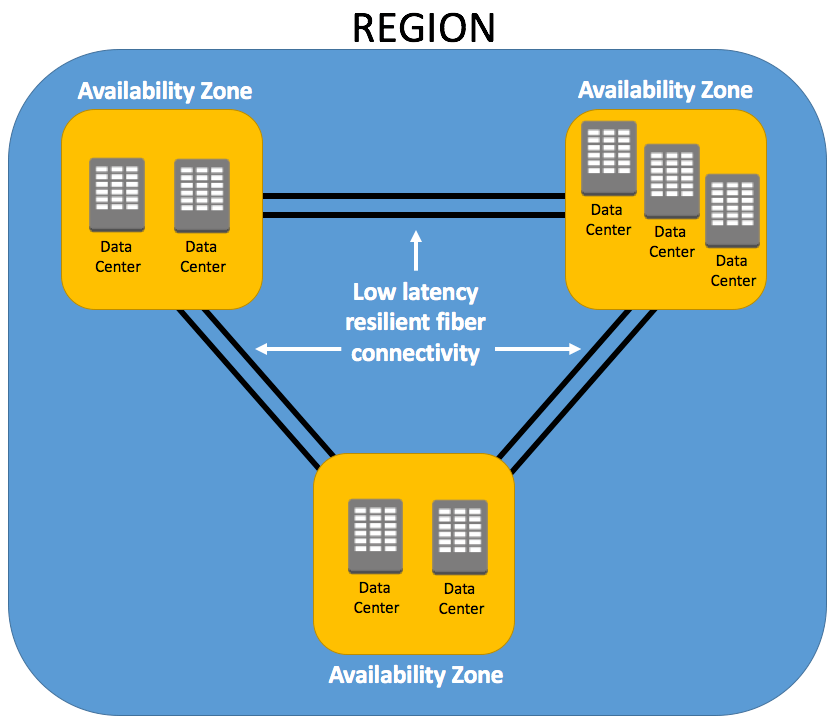
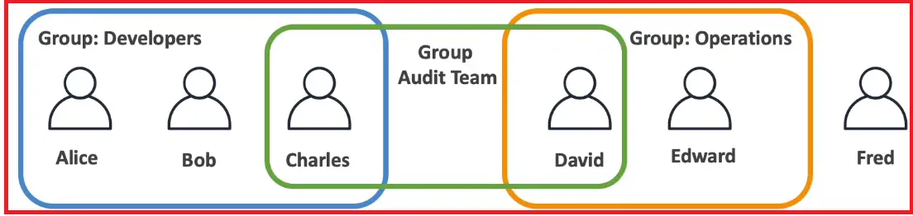

# AWS

  
Region

  
There are multiple Region in world basically regions are cluster of data center/p>

  
Availability Zone

  
In each region there will be minimum 3 and max 6 Availability Zone every availabilty zone is connected with each other with high fiber connectivity

  

IAM

IAM stands for indetity access management and it is a global services

  

Groups

Groups can only contains users not groups

Users

Users don't have to belong to any group, a user can belong to multiple groups

